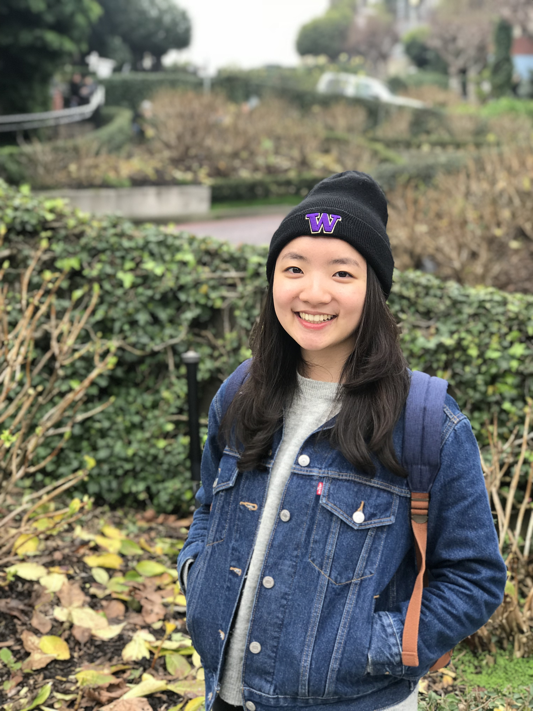

# Amanda Kao

yhk5uw@gmail.com

https://www.linkedin.com/in/amanda-kao-177b08180/

https://github.com/amandakaoo

## About

A senior student majoring in Geography with GIS track at the University of Washington. Although I'm kind of late to join this field and found out the interest in it, working hard to advance my knowledge and skills in GIS. It's never too late to learn. I am patient and hard-working, having the passion to discover the things that happened around the world. I love traveling.

As WNBA Player Sue Bird said:
> Never Let the Fear of Failing Discourage You for Trying.

## Experience

#### *UW Circle K International (CKI), Seattle, Washington*
*Member/Volunteer (Sept. 2018 – Present)*
- Serviced the Great Seattle Area Community, including some weekly events: Food Bank, Soup Kitchen
- Examples of Volunteer Events: Clothing Drives, Books to Prisoners, Lake Washington Clean Up, etc.

#### *Chinese Information and Service Center (CISC), Seattle, Washington*
*Volunteer (Sept. 2017 – February 2020)*
- Helped immigrants throughout Seattle areas achieve success in their new community by providing ESL classes, computer classes, and other support services/Served over 400 people in the community
- One on one mock interview for the Chinese immigrants who want to pass the citizenship tests and become U.S. citizens

#### *Shanghai Children’s Art Theatre (SHCAT)*
*Intern (July 2018 – August 2018)*
- Assisted in preparing and hosting various programs by abroad theatrical companies
- Assisted in preparing information and research materials in oversea performing artists
- Assisted in managing stage sets in the theatre

#### *Taiwanese Youth Alliance of Pacific Northwest (TYAPN), University of Washington*
*Event Planning and HR Panel Officer (Sept. 2017 – June 2018)*
- Held events and provided a platform for students in the Pacific Northwest and locals to network while spreading the Taiwanese culture and strive to cultivate talents
- Reach out to other related organizations to join the events, organized conferences and community events

## Skills
##### Programming Languages & Tools
* HTML
* ArcMap
* Tableau
* Beginning Python

##### Languages
* Native Mandarin
* Fluent English

## Interests
Apart from being a student and studying, I enjoy
* traveling
* watching sports games
* listening to music
* doing jigsaw puzzles

[University 1]: http://www.univ1.edu
[University 2]: http://www.univ2.edu
[University 3]: http://www.univ3.edu
